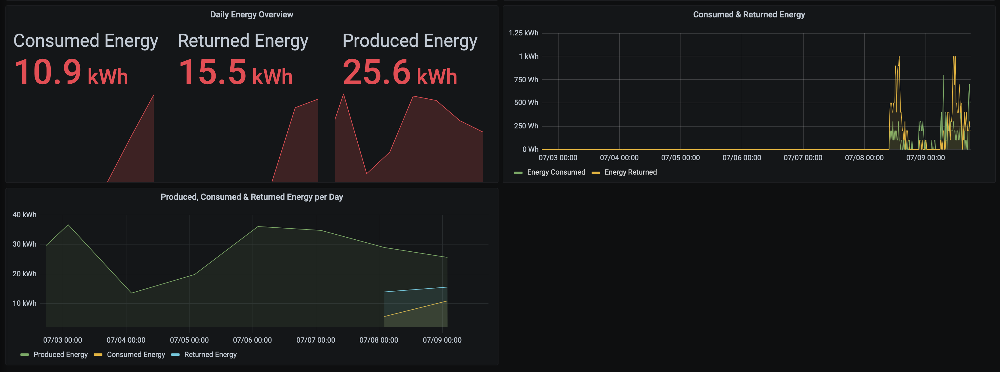

# shelly-em-reader

shelly energy meter reader, which grabs the data from the device and put these information into a influx db (the influx API v2 is used, which is compatible with Influxdb2 and Influxdb 1.x).

## Docker Image

You can find the Docker image on [Docker Hub](https://hub.docker.com/repository/docker/pendl2/shelly-em-reader)

If you want to run a container, you can use the command `docker run pendl2/shelly-em-reader`

There are different tags available for common processor architectures:
* latest
* the project-version itself

## Configuration

Docker Environment Variable | Default | Description
------------ | ------------- | -------------
SHELLY.HOST | shelly-3em | The hostname or ip of the shelly 3em device
LOG.LEVEL | INFO | Log Level, can be switched to debug, for detailed information
POLL.TIME.MS | 10000 | Poll Time in ms
INFLUXDB.HOST | localhost | The host where the influx service is running
INFLUXDB.PORT | 8086 | The port where the service is running
INFLUXDB.BUCKET | home  | The bucket
INFLUXDB.ORG | pendulum | The organisation which is sent to the InfluxDB
INFLUXDB.USER.TOKEN | | If this environment is set, the token will be added to the request, if not, no authentication is used

Example:
setting the host 0.0.0.0 via environment: `sudo docker run -e SHELLY.HOST=0.0.0.0 pendl2/shelly-em-reader`

## Multi-Container Configuration

I created a multi-container configuration, which contains:
* InfluxDb
* Grafana
* Shelly Energy Meter Reader (this project)
* Fronius Energy Consumption (other project)

You can find the details in the following repo: [Multi Container Project](https://github.com/lukeSky3434/multi-container-arm)

You can easily define dashboards with grafana, here is an example of my dashboard:

